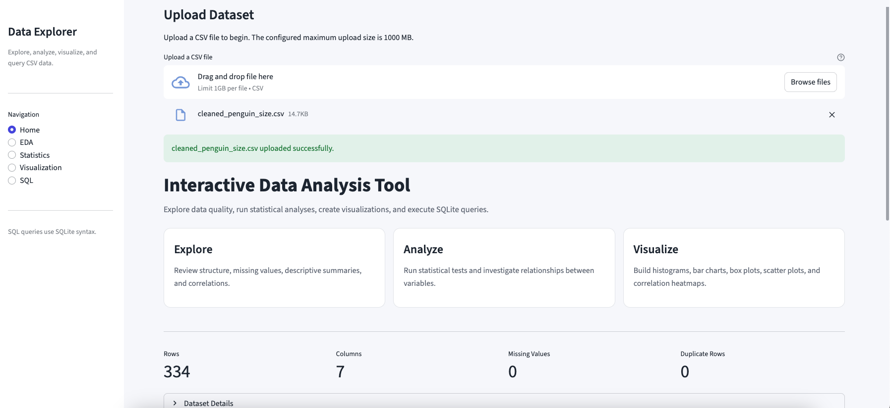
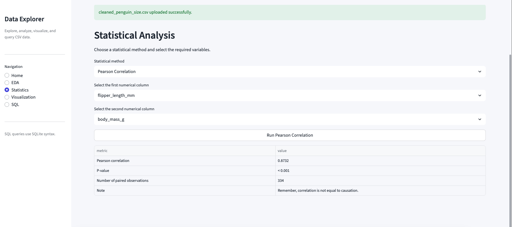
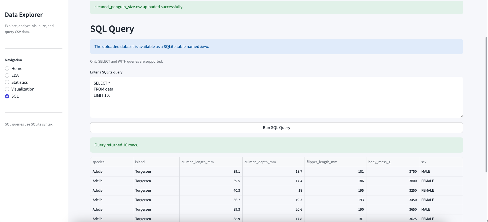

# Interactive Data Analysis Tool

An interactive Streamlit application for exploring, analyzing, visualizing, and querying CSV datasets.

## Live Application

The live application link will be added after deployment.

## Application Preview

### Home & Dataset Overview



### Statistical Analysis



### SQL Query



## Features

### Exploratory Data Analysis

- Dataset overview
- Descriptive statistics
- Categorical summaries
- Group summaries
- Correlation matrix

### Statistical Analysis

- Independent Welch's t-test
- One-way ANOVA
- Pearson correlation
- Simple OLS regression

### Data Visualization

- Histogram
- Bar chart
- Box plot
- Scatter plot
- Correlation heatmap

### SQL Query

- Execute read-only SQLite `SELECT` and `WITH` queries
- Uploaded data is available as a table named `data`

## Technologies

- Python
- Pandas
- NumPy
- SciPy
- Statsmodels
- Matplotlib
- Seaborn
- SQLite
- Streamlit

## Project Structure

    interactive_data_analysis_tool/
    ├── app.py
    ├── analysis_functions.py
    ├── requirements.txt
    ├── README.md
    ├── screenshots/
    │   ├── 1.png
    │   ├── 2.png
    │   └── 3.png
    └── .streamlit/
        └── config.toml

## Run Locally

```bash
python -m pip install -r requirements.txt
python -m streamlit run app.py
```
